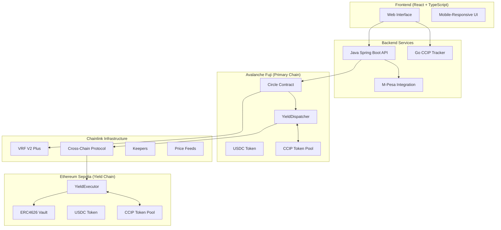

# 🌍 Circles: Cross-Chain Savings Circles for DeFi

A comprehensive full-stack platform that brings traditional African savings circles (ROSCAs) to DeFi with automated cross-chain yield optimization, powered by Chainlink's oracle infrastructure.

## 🎯 Overview

Circles digitizes traditional rotating savings and credit associations (known as _chamas_ in Kenya, _tandas_ in Latin America, or _tontines_ in West Africa) used by over 200 million people globally. Our platform combines the social trust of community finance with blockchain transparency and automated yield generation across multiple chains.

### 🚀 Key Features

- **🤝 Decentralized Savings Circles**: Member-managed rotating savings groups with 25% approval thresholds
- **⚡ Cross-Chain Yield Farming**: Automated deployment of idle funds across Avalanche and Ethereum
- **🎲 Fair Recipient Selection**: Chainlink VRF-powered cryptographically secure randomness
- **💰 Yield Generation**: Earn 5-15% APY while waiting for payout turns (vs 0% in traditional circles)
- **🌐 Seamless UX**: Single-chain experience with automatic cross-chain operations
- **📱 Modern Interface**: React-based frontend with real-time transaction tracking
- **🔗 M-Pesa Integration**: Direct fiat on-ramp from Kenyan mobile money to crypto

## 🏗️ Architecture Overview



## 📁 Project Structure

```
circles/
├── 📱 client/                    # React + TypeScript Frontend
│   ├── src/
│   │   ├── components/          # Reusable UI components
│   │   ├── pages/               # Main application pages
│   │   ├── hooks/               # Custom React hooks for Web3
│   │   └── lib/                 # Utilities and configurations
│   ├── package.json
│   └── README.md               # Frontend setup instructions
│
├── ⚡ contracts/                 # Solidity Smart Contracts
│   ├── src/
│   │   ├── Circle.sol          # Main ROSCA implementation
│   │   ├── YieldDispatcher.sol # Cross-chain fund management
│   │   ├── YieldExecutor.sol   # Yield farming execution
│   │   └── interfaces/         # Contract interfaces
│   ├── script/                 # Deployment and management scripts
│   ├── test/                   # Comprehensive test suite
│   ├── Makefile               # 40+ deployment commands
│   └── README.md              # Smart contract documentation
│
├── ☕ backend/                   # Java Spring Boot API
│   ├── src/main/java/
│   │   ├── controller/         # REST API endpoints
│   │   ├── service/            # Business logic (M-Pesa, Blockchain)
│   │   ├── model/              # Data models
│   │   └── repository/         # Data access layer
│   ├── pom.xml
│   └── README.md              # M-Pesa integration flow
│
└── 🔄 server/                   # Go CCIP Transaction Tracker
    ├── src/main.go
    ├── go.mod
    └── README.md              # CCIP tracking service
```

## 🚀 Quick Start Guide

### Prerequisites

- **Node.js** (v18+)
- **Java** (21+)
- **Go** (1.24+)
- **Foundry** (for smart contracts)
- **MetaMask** or compatible Web3 wallet

### 1. Clone the Repository

```bash
git clone https://github.com/your-org/circles.git
cd circles
```

### 2. Smart Contracts Setup

```bash
cd contracts
cp .env.example .env
# Add your RPC URLs and private keys

# Install dependencies
forge install

# Deploy to testnets (single command deploys everything)
make full-deploy-all

# Run tests
forge test
```

### 3. Frontend Setup

```bash
cd client
npm install

# Start development server
npm run dev
```

Visit `http://localhost:5173` to access the application.

### 4. Backend Services

#### Java API (M-Pesa Integration)

```bash
cd backend

# Configure M-Pesa credentials in application.properties
./mvnw spring-boot:run
```

API available at `http://localhost:8080`

#### Go CCIP Tracker

```bash
cd server
go run src/main.go
```

Service available at `http://localhost:8080`

## 💡 How It Works

### For Users

1. **👥 Join a Circle**: Request membership and get approved by 25% of existing members
2. **💰 Make Contributions**: Monthly fixed USDC contributions to the shared pool
3. **🎲 Fair Selection**: Chainlink VRF randomly selects recipients each payout period
4. **📈 Earn Yield**: Idle funds automatically deployed across chains for yield generation
5. **💵 Receive Payouts**: Withdraw your turn's payout plus accumulated yield earnings

### For Developers

1. **🔗 Cross-Chain Architecture**: Single deposit on Avalanche, yield farming on Ethereum
2. **🤖 Automated Operations**: Chainlink Automation triggers monthly selections
3. **🔒 Security First**: Role-based access control and emergency mechanisms
4. **⛽ Gas Optimized**: Batch operations and efficient cross-chain messaging

## 🌟 Key Technologies

### Blockchain & Smart Contracts

- **Solidity** ^0.8.24 with Foundry framework
- **Chainlink CCIP** for cross-chain token transfers
- **Chainlink VRF V2 Plus** for verifiable randomness
- **OpenZeppelin** contracts for security standards
- **ERC4626** vaults for standardized yield farming

### Frontend

- **React 19** with TypeScript
- **Thirdweb SDK** for Web3 integration
- **Tailwind CSS** for responsive design
- **Framer Motion** for smooth animations
- **React Query** for efficient data fetching

### Backend Services

- **Java Spring Boot** for M-Pesa integration
- **Go** for high-performance CCIP tracking
- **H2 Database** for transaction management
- **OkHttp** for external API communication

## 🔗 Live Deployments

### Smart Contracts

#### Avalanche Fuji Testnet

- **Circle Contract (Current)**: `0x2B17ec13D1E6bA06d06B39e02d0ad7FaE33D6520`
- **Circle Contract (Legacy)**: `0xb8c7fb66D2f2d71F47378CAcA7f9ca32008F3286`
- **YieldDispatcher (Current)**: `0xC089C6574bA12ef9Db724757Fd3886Ed49940e1f`
- **YieldDispatcher (Legacy)**: `0xa3e73B9E6261A950616881a8A084842efB9bdC49`
- **Ramping Contract**: `0x964A2c9313A294360589dCCd9A19c4c1B60e40aF`
- **USDC Token**: `0x60A15CA6b63508562d0Cdc9Cf896A9e3bBF79463`
- **Token Pool**: `0x2D9bf08C367fe7CF2d5d76E43fCFE46cE7660691`
- **Mock Vault**: `0xFfabAdA8EDfdF406a95Beb95ef456ED9287b272D`
- **VRF Coordinator**: `0x5C210eF41CD1a72de73bF76eC39637bB0d3d7BEE`

#### Ethereum Sepolia Testnet

- **YieldExecutor**: `0x35b8C50ae752414C0e1Ff49Ed774763124E4BfF2`
- **Mock Vault**: `0xB96C5d0a79B7901A49DB43782CdD8E35720971Be`
- **USDC Token**: `0x60A15CA6b63508562d0Cdc9Cf896A9e3bBF79463`
- **Token Pool**: `0x7c84f757F4DB3a80be60B269e6B993740F24E5e9`
- **Token Admin**: `0x0bd7dd9A885d9526Ff82813829ef5c7D8AfdB8c4`

### Services

- **Frontend**: [Demo Application](https://circles-kappa.vercel.app)
- **CCIP Explorer**: [Track Cross-Chain Messages](https://ccip.chain.link)

## 🧪 Testing & Development

### Smart Contracts

```bash
cd contracts
forge test --gas-report
forge test --match-path test/unit/CircleTest.t.sol
```

### Frontend

```bash
cd client
npm run test
npm run build
```

### Backend

```bash
cd backend
./mvnw test
./mvnw spring-boot:run
```

## 📊 Market Impact

- **200M+ Users**: Target audience using traditional savings circles globally
- **$100B+ Volume**: Annual transaction volume in informal savings groups
- **Financial Inclusion**: Bridge traditional community finance with modern DeFi
- **Yield Generation**: Transform idle savings into productive capital across chains

## 🔐 Security Considerations

- **✅ Role-Based Access**: OpenZeppelin AccessControl for member permissions
- **✅ Cross-Chain Validation**: Allowlisted chains and authorized dispatchers
- **✅ Rate Limiting**: CCIP pools with configurable transfer limits
- **✅ Emergency Controls**: Owner-controlled pause and withdrawal mechanisms
- **⚠️ Testnet Only**: Current deployment is for testing - audits required for mainnet

## 🤝 Contributing

We welcome contributions! Please see our [Contributing Guide](CONTRIBUTING.md) for details.

### Development Workflow

1. Fork the repository
2. Create a feature branch
3. Make your changes
4. Add tests for new functionality
5. Submit a pull request

## 📚 Documentation

- **[Smart Contracts](./contracts/README.md)**: Detailed contract documentation and deployment guides
- **[Frontend](./client/README.md)**: React application setup and component documentation
- **[Backend API](./backend/README.md)**: M-Pesa integration and transaction flow
- **[CCIP Tracker](./server/README.md)**: Cross-chain transaction monitoring service

## 📄 License

This project is licensed under the MIT License - see the [LICENSE](LICENSE) file for details.

## 🙏 Acknowledgments

- **Chainlink**: For robust oracle infrastructure (VRF, CCIP, Automation, Data Feeds)
- **OpenZeppelin**: For battle-tested smart contract security patterns
- **Thirdweb**: For excellent Web3 developer experience
- **Community**: Traditional savings circle participants who inspired this innovation

---

**⚡ Built for the Chainlink Chromium Hackathon**

_Bridging traditional African finance with cutting-edge DeFi technology_
