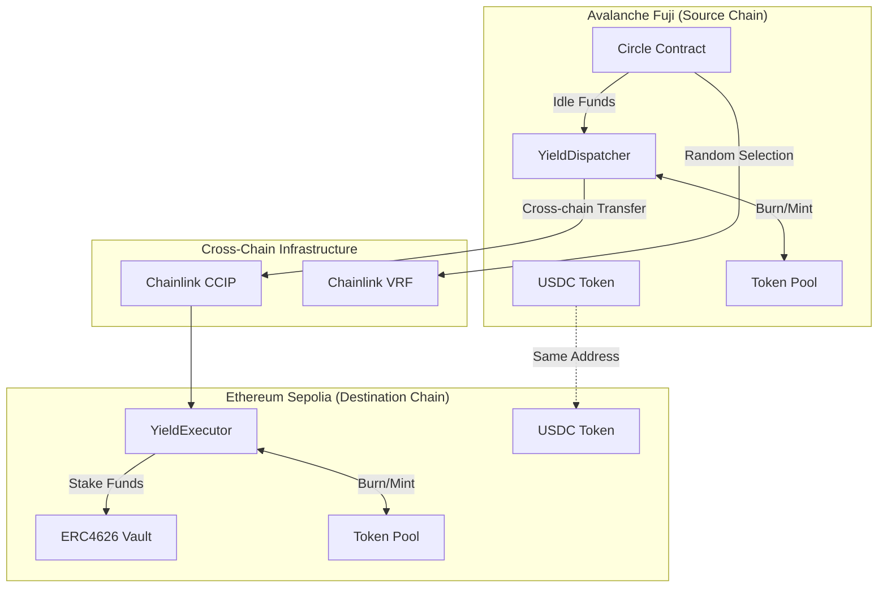
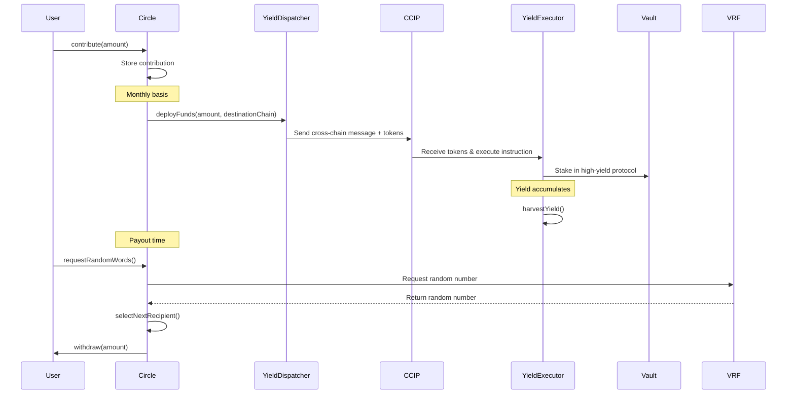
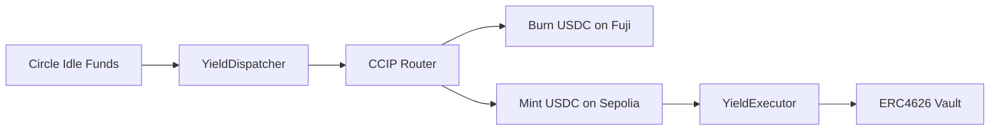
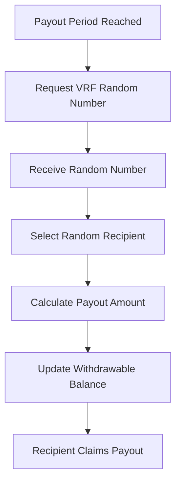

# Circle Contribution System

A sophisticated decentralized rotating savings group (ROSCA) implementation with **cross-chain capabilities** using Chainlink CCIP and **cross-chain yield farming**. Members contribute to shared pools and receive payouts through verifiable random selection, while idle funds generate yield across multiple blockchains.

## 🌟 Recent Major Updates

### ✨ Advanced Cross-Chain Yield Farming

- **Dual-Contract Architecture**: Specialized YieldDispatcher (source) and YieldExecutor (destination) contracts
- **Cross-chain fund deployment** from Avalanche Fuji to Ethereum Sepolia
- **Automated yield strategy execution** on destination chains
- **Secure cross-chain withdrawal** mechanisms

### 🔧 Enhanced Chainlink CCIP Integration

- **Cross-chain token transfers** between Ethereum Sepolia and Avalanche Fuji
- **Burn & Mint token pools** for seamless USDC bridging
- **Rate limiting** and security controls for cross-chain operations
- **Automated deployment and configuration** across multiple chains

## 🏗️ System Architecture



## 💰 Fund Flow Sequence



## 📋 Deployed Contract Addresses

### Ethereum Sepolia (Chain ID: 11155111)

| Contract          | Address                                      | Purpose                                      |
| ----------------- | -------------------------------------------- | -------------------------------------------- |
| **USDC Token**    | `0x60A15CA6b63508562d0Cdc9Cf896A9e3bBF79463` | Cross-chain USDC with burn/mint capabilities |
| **Token Pool**    | `0x7c84f757F4DB3a80be60B269e6B993740F24E5e9` | CCIP token pool for cross-chain transfers    |
| **YieldExecutor** | `0x35b8C50ae752414C0e1Ff49Ed774763124E4BfF2` | Executes yield strategies on Sepolia         |
| **Mock Vault**    | `0xB96C5d0a79B7901A49DB43782CdD8E35720971Be` | ERC4626 vault for yield generation           |
| **Token Admin**   | `0x0bd7dd9A885d9526Ff82813829ef5c7D8AfdB8c4` | Token administrator address                  |

### Avalanche Fuji (Chain ID: 43113)

| Contract            | Address                                      | Purpose                                      |
| ------------------- | -------------------------------------------- | -------------------------------------------- |
| **USDC Token**      | `0x60A15CA6b63508562d0Cdc9Cf896A9e3bBF79463` | Cross-chain USDC with burn/mint capabilities |
| **Token Pool**      | `0x2D9bf08C367fe7CF2d5d76E43fCFE46cE7660691` | CCIP token pool for cross-chain transfers    |
| **YieldDispatcher** | `0xa3e73B9E6261A950616881a8A084842efB9bdC49` | Manages cross-chain fund deployment          |
| **Circle Contract** | `0x57a867C0410c98C1BF637D933B46367E489088DF` | Main ROSCA implementation                    |
| **Mock Vault**      | `0xFfabAdA8EDfdF406a95Beb95ef456ED9287b272D` | ERC4626 vault for yield generation           |
| **VRF Coordinator** | `0x5C210eF41CD1a72de73bF76eC39637bB0d3d7BEE` | Chainlink VRF coordinator for randomness     |
| **Token Admin**     | `0x0bd7dd9A885d9526Ff82813829ef5c7D8AfdB8c4` | Token administrator address                  |

### Network Configuration

| Network              | Chain Selector         | Router                                       | RMN Proxy                                    | Token Admin Registry                         |
| -------------------- | ---------------------- | -------------------------------------------- | -------------------------------------------- | -------------------------------------------- |
| **Ethereum Sepolia** | `16015286601757825753` | `0x0BF3dE8c5D3e8A2B34D2BEeB17ABfCeBaf363A59` | `0xba3f6251de62dED61Ff98590cB2fDf6871FbB991` | `0x95F29FEE11c5C55d26cCcf1DB6772DE953B37B82` |
| **Avalanche Fuji**   | `14767482510784806043` | `0xF694E193200268f9a4868e4Aa017A0118C9a8177` | `0xAc8CFc3762a979628334a0E4C1026244498E821b` | `0xA92053a4a3922084d992fD2835bdBa4caC6877e6` |

## 🔧 Technical Implementation

### ✅ Completed Features

#### Core Circle Functionality

- **Circle Contract**: Complete ROSCA implementation with member management
- **Contribution System**: Fixed-amount monthly contributions with USDC
- **Random Selection**: Chainlink VRF for fair recipient selection
- **Approval-based Membership**: 25% member approval threshold for new joiners
- **Safe Exit Mechanism**: Members can leave with safety checks

#### Cross-Chain Yield Infrastructure

- **YieldDispatcher**: Source chain contract managing fund deployment
- **YieldExecutor**: Destination chain contract executing yield strategies
- **Cross-chain Communication**: CCIP integration for secure messaging
- **ERC4626 Integration**: Compatible with standard yield-bearing vaults

#### Security Features

- **Role-based Access Control**: OpenZeppelin AccessControl implementation
- **SafeERC20 Integration**: Secure token transfers
- **Cross-chain Validation**: Allowlisted sources and destinations
- **Emergency Functions**: Owner-controlled emergency withdrawals

### 📋 Key Functions by Contract

#### Circle Contract

```solidity
// Member management
function joinCircle() external;
function approveMember(address _member) external onlyRole(CIRCLER);
function leaveCircle() external onlyRole(CIRCLER);

// Contribution and payout
function contribute(uint256 _amount) external onlyRole(CIRCLER);
function selectNextRecipient() external;
function withdraw(uint256 _amount) external;

// VRF integration
function requestRandomWords(bool enableNativePayment) external onlyOwner;
```

#### YieldDispatcher (Fuji)

```solidity
// Fund deployment
function deployFunds(uint256 _amount, uint64 _destinationChain, address _protocol) external;

// Cross-chain management
function setChainExecutor(uint64 _chainSelector, address _executor) external onlyOwner;
function allowlistChain(uint64 _chainSelector, bool _allowed) external onlyOwner;

// Withdrawal requests
function requestWithdrawal(uint64 _destinationChain, uint256 _amount, address _recipient) external;
```

#### YieldExecutor (Sepolia)

```solidity
// CCIP message handling
function _ccipReceive(Client.Any2EVMMessage memory message) internal override;

// Yield management
function harvestYield() external onlyOwner;
function withdrawFundsToSourceChain(uint64 _sourceChain, uint256 _amount, address _token, address _recipient) external;

// Configuration
function setAuthorizedDispatcher(uint64 _sourceChainSelector, address _dispatcher) external onlyOwner;
```

### 🔄 Operational Flows

#### 1. Cross-Chain Fund Deployment



#### 2. Monthly Payout Process



### ⚙️ Configuration Parameters

#### Circle Settings

- **Payout Period**: 30 days
- **Minimum Approval**: 25% of current members
- **Contribution Amount**: Fixed per circle (set at deployment)

#### VRF Configuration

- **Coordinator**: `0x5C210eF41CD1a72de73bF76eC39637bB0d3d7BEE` (Fuji)
- **Key Hash**: `0xc799bd1e3bd4d1a41cd4968997a4e03dfd2a3c7c04b695881138580163f42887`
- **Callback Gas Limit**: 2,500,000
- **Request Confirmations**: 3

#### CCIP Rate Limits

- **Capacity**: 1,000,000 USDC
- **Refill Rate**: 100,000 USDC/second

## 🚀 Quick Start Guide

### Prerequisites

1. **Environment Setup**

   ```bash
   cp .env.example .env
   # Add your RPC URLs:
   # ETH_SEPOLIA_RPC_URL=your_sepolia_rpc_url
   # AVALANCHE_FUJI_RPC_URL=your_fuji_rpc_url
   ```

2. **Install Dependencies**

   ```bash
   forge install
   ```

3. **Setup Foundry Account**
   ```bash
   cast wallet import dev --interactive
   ```

### 🎯 One-Command Deployment

Deploy complete system across both chains:

```bash
make full-deploy-all
```

This command will:

- Deploy USDC tokens with identical addresses on both chains
- Deploy and configure token pools
- Deploy yield system (YieldDispatcher + YieldExecutor)
- Configure cross-chain connectivity
- Set up admin roles and permissions

### 🔧 Common Operations

#### Deploy Funds to Yield Protocol

```bash
# Deposit 10 USDC from Fuji to Sepolia yield farming
make deposit-funds

# Deposit custom amount (25 USDC)
make deposit-funds-amount AMOUNT=25
```

#### Withdraw Yield Earnings

```bash
# Withdraw default amount (5 USDC)
make withdraw-funds

# Withdraw custom amount to specific recipient
make withdraw-funds-amount AMOUNT=10 RECIPIENT=0x123...
```

#### Check System Status

```bash
# Check authorization and balances
make check-deposit-status

# Check withdrawal status and deployed capital
make check-withdraw-status
```

### 📊 Monitoring and Verification

#### CCIP Message Tracking

- **CCIP Explorer**: [https://ccip.chain.link](https://ccip.chain.link)
- Messages include unique messageId for tracking
- View cross-chain transaction status and confirmations

#### Contract Verification

All contracts are verified on respective block explorers:

- **Sepolia**: [https://sepolia.etherscan.io](https://sepolia.etherscan.io)
- **Fuji**: [https://testnet.snowtrace.io](https://testnet.snowtrace.io)

## 🧪 Testing

### Run Test Suite

```bash
# Run all tests
forge test

# Run with gas reporting
forge test --gas-report

# Run specific test file
forge test --match-path test/unit/CircleTest.t.sol
```

### Integration Testing

The system includes comprehensive integration tests covering:

- Cross-chain message flows
- VRF random number generation
- Token bridging and minting/burning
- Yield strategy execution
- Emergency scenarios

## 🚧 Development Roadmap

### Phase 1: Core Enhancement (In Progress)

- [ ] Multi-protocol yield strategy integration (Aave, Compound)
- [ ] Dynamic yield optimization based on rates
- [ ] Minimum member enforcement (5 members)
- [ ] Contribution period validation

### Phase 2: Advanced Features

- [ ] Automated yield compounding
- [ ] Cross-chain governance system
- [ ] Multi-token support beyond USDC
- [ ] Mobile-friendly frontend integration

### Phase 3: Production Ready

- [ ] Mainnet deployment preparation
- [ ] Comprehensive security audits
- [ ] Gas optimization across all contracts
- [ ] Advanced monitoring and alerting

## 📁 Project Structure

```
contracts/
├── src/
│   ├── Circle.sol                    # Main ROSCA implementation
│   ├── YieldDispatcher.sol          # Cross-chain fund deployment
│   ├── YieldExecutor.sol            # Destination chain yield execution
│   ├── TestUsdc.sol                 # Cross-chain USDC token
│   ├── BurnMintUsdcPool.sol         # CCIP token pool
│   ├── interfaces/                  # Contract interfaces
│   └── libraries/                   # VRF and utility libraries
├── script/
│   ├── deployments/                 # Deployment scripts
│   ├── DepositYieldFunds.s.sol      # Cross-chain fund deposit
│   ├── WithdrawYieldFunds.s.sol     # Cross-chain fund withdrawal
│   ├── TokenTransfer.s.sol          # Direct token transfers
│   └── utils/                       # Helper configurations
├── test/
│   ├── unit/                        # Unit tests
│   └── mocks/                       # Mock contracts for testing
├── broadcast/                       # Deployment artifacts
└── Makefile                         # 40+ deployment and management commands
```

## 🔐 Security Considerations

### Access Control

- **Owner-only functions**: Emergency withdrawals, configuration changes
- **Role-based permissions**: CIRCLER role for circle members
- **Multi-signature**: Recommended for production deployments

### Cross-Chain Security

- **Allowlisted chains**: Only approved chains can send/receive messages
- **Authorized dispatchers**: YieldExecutor only accepts from known dispatchers
- **Rate limiting**: CCIP pools have configurable rate limits
- **Message validation**: All cross-chain messages are validated before execution

### Emergency Procedures

- **Emergency withdrawals**: Owner can withdraw all funds if needed
- **Circuit breakers**: Contracts can be paused in emergency situations
- **Upgrade patterns**: Contracts use proxy patterns for upgradability

---

**⚠️ Testnet Disclaimer**: This implementation is currently configured for testnets (Sepolia & Fuji). Do not use with mainnet funds. Comprehensive audits are required before mainnet deployment.

**🔗 Useful Links**

- [Chainlink CCIP Documentation](https://docs.chain.link/ccip)
- [Foundry Book](https://book.getfoundry.sh/)
- [ERC4626 Specification](https://eips.ethereum.org/EIPS/eip-4626)
- [OpenZeppelin Access Control](https://docs.openzeppelin.com/contracts/4.x/access-control)

- **Chainlink VRF Integration**: Verifiable random number generation for fair recipient selection
- **Round Management**: Automatic tracking of remaining recipients in each payout round
- **Payout Distribution**: Secure withdrawal system for selected recipients

#### Security Features

- **SafeERC20 Integration**: Safe token transfers using OpenZeppelin's SafeERC20
- **Access Control**: Role-based permissions (CIRCLER role for members)
- **Input Validation**: Comprehensive error handling and validation
- **CREATE2 Deterministic Deployment**: Same contract addresses across all supported chains

### 🏗️ Contract Architecture

#### Cross-Chain Token Infrastructure

```solidity
// USDC Token with burn/mint capabilities
contract BurnMintUsdc is BurnMintERC20 {
    // Deterministic deployment via CREATE2
    // Same address on Sepolia: 0x0731a41e4caf92D586267230Be3b8718422ba329
    // Same address on Fuji: 0x0731a41e4caf92D586267230Be3b8718422ba329
}

// Cross-chain token pool for CCIP
contract TestUsdcTokenPool is BurnMintTokenPool {
    // Handles cross-chain token transfers
    // Rate limiting and security controls
    // Integration with TokenAdminRegistry
}
```

#### Core Circle Logic

```solidity
contract Circle is AccessControl, VRFConsumerBaseV2Plus {
    // Core member and contribution tracking
    mapping(address => uint256) public contributions;
    mapping(address => uint256) public withdrawableAmount;
    mapping(address => uint256) public approvalCount;

    address[] public members;
    address[] public pendingMembers;
    address[] remainingRecipientsInRound;
}
```

### 🌐 Supported Networks

| Network          | Chain ID | CCIP Chain Selector  | USDC Token Address                         |
| ---------------- | -------- | -------------------- | ------------------------------------------ |
| Ethereum Sepolia | 11155111 | 16015286601757825753 | 0x0731a41e4caf92D586267230Be3b8718422ba329 |
| Avalanche Fuji   | 43113    | 14767482510784806043 | 0x0731a41e4caf92D586267230Be3b8718422ba329 |

### 📋 Key Functions Implemented

#### Cross-Chain Operations (NEW)

- `ccipSend()`: Send tokens across chains via CCIP router
- `applyChainUpdates()`: Configure cross-chain pool connections
- `setPool()`: Register token pools in TokenAdminRegistry
- `claimAdmin()` / `acceptAdminRole()`: Manage token admin permissions

#### Member Management

- `joinCircle()`: Join circle after receiving sufficient approvals
- `approveMember(address)`: Approve a pending member (requires CIRCLER role)
- `leaveCircle()`: Exit the circle (with safety checks)

#### Contribution & Payout

- `contribute(uint256)`: Make monthly contribution (fixed amount)
- `selectNextRecipient()`: Randomly select next payout recipient
- `withdraw(uint256)`: Withdraw available payout funds
- `requestRandomWords(bool)`: Trigger VRF request for random selection

#### Utility Functions

- `getNextPayoutDate()`: View when next payout is due
- `getRequestStatus(uint256)`: Check VRF request status

### 🔧 Technical Stack

- **Solidity**: ^0.8.24
- **Framework**: Foundry
- **Cross-Chain**: Chainlink CCIP
- **Dependencies**:
  - OpenZeppelin Contracts (AccessControl, SafeERC20)
  - Chainlink CCIP (Cross-chain messaging and token transfers)
  - Chainlink VRF V2Plus (for verifiable randomness)
- **Token Standard**: ERC20 with Burn & Mint capabilities (USDC)
- **Deployment**: CREATE2 for deterministic addresses across chains

### ⚙️ Configuration

#### Circle Settings

- **Payout Period**: 30 days
- **Minimum Approval Threshold**: 25% of current members
- **VRF Settings**:
  - Callback Gas Limit: 2,500,000
  - Request Confirmations: 3

#### CCIP Rate Limits

- **Capacity**: 1,000,000 USDC (maximum tokens that can be transferred)
- **Refill Rate**: 100,000 USDC per second

## 🚀 Quick Start

### Prerequisites

1. **Environment Setup**

   ```bash
   cp .env.example .env
   # Add your RPC URLs:
   # ETH_SEPOLIA_RPC_URL=your_sepolia_rpc_url
   # AVALANCHE_FUJI_RPC_URL=your_fuji_rpc_url
   ```

2. **Install Dependencies**

   ```bash
   forge install
   ```

3. **Setup Foundry Account**
   ```bash
   cast wallet import dev --interactive
   # Follow prompts to import your private key
   ```

### 🎯 One-Command Deployment

Deploy everything across both chains with cross-chain connectivity:

```bash
make full-deploy-all
```

This single command will:

- Deploy USDC tokens on both Sepolia and Fuji
- Deploy token pools on both chains
- Configure pools in token admin registry
- Set up bidirectional cross-chain connectivity

### 📝 Available Make Commands

#### Basic Operations

```bash
make setup                     # Copy .env.example to .env
make build                     # Build contracts
make test                      # Run tests
make clean                     # Clean build artifacts
```

#### Token Deployment

```bash
make deploy-sepolia            # Deploy USDC token to Sepolia
make deploy-fuji               # Deploy USDC token to Fuji
make deploy-all                # Deploy USDC token to both chains
```

#### Pool Deployment

```bash
make deploy-pool-sepolia       # Deploy token pool to Sepolia
make deploy-pool-fuji          # Deploy token pool to Fuji
make deploy-pools              # Deploy token pools to both chains
```

#### Configuration

```bash
make configure-pool-sepolia    # Configure pool on Sepolia
make configure-pool-fuji       # Configure pool on Fuji
make configure-cross-chain     # Setup bidirectional connectivity
```

#### Token Transfers

```bash
make transfer-tokens-sepolia   # Transfer tokens from Sepolia to Fuji
```

#### Admin Management

```bash
make claim-admin-sepolia       # Claim admin role on Sepolia
make claim-admin-fuji          # Claim admin role on Fuji
make claim-admin               # Claim admin role on both chains
```

### 🚧 Development Features

- [ ] Treasury/Vault system for yield generation on idle funds
- [ ] Integration with high-yield DeFi protocols
- [ ] Minimum member enforcement (5 members)
- [ ] Contribution period enforcement
- [ ] Emergency pause/unpause functionality
- [ ] Cross-chain circle synchronization
- [ ] Gas optimization across chains

### 📁 Project Structure

```
contracts/
├── src/
│   ├── Circle.sol                    # Main circle contract
│   ├── TestUsdc.sol                  # Cross-chain USDC token with burn/mint
│   ├── BurnMintUsdcPool.sol         # CCIP token pool for cross-chain transfers
│   ├── YieldDispatcher.sol          # Yield farming dispatcher
│   ├── YieldExecutor.sol            # Yield farming executor
│   ├── interfaces/                  # Interface definitions
│   └── libraries/                   # VRF and utility libraries
├── script/
│   ├── DeployTestUsdcCreate2.s.sol  # USDC token deployment (CREATE2)
│   ├── DeployTokenPool.s.sol        # Token pool deployment
│   ├── SetAndConfigureTokenPool.s.sol # Pool configuration and cross-chain setup
│   ├── ClaimAndAcceptAdminRole.s.sol # Admin role management
│   ├── TokenTransfer.s.sol          # Cross-chain token transfer
│   └── utils/
│       ├── HelperConfig.s.sol       # Network configurations
│       └── HelperUtils.s.sol        # Utility functions
├── test/
│   └── unit/
│       └── CircleTest.t.sol         # Unit tests
├── broadcast/                       # Deployment artifacts
├── Makefile                         # 20+ deployment and management commands
└── POOL_DEPLOYMENT_GUIDE.md        # Detailed deployment guide
```

### 🧪 Testing

```bash
# Run all tests
forge test

# Run tests with gas reporting
forge test --gas-report

# Run specific test file
forge test --match-path test/unit/CircleTest.t.sol
```

### 🔍 Verification

Check cross-chain message status at:

- [CCIP Explorer](https://ccip.chain.link)
- Message ID will be displayed after cross-chain transfers

### 📚 Additional Resources

- [Pool Deployment Guide](./POOL_DEPLOYMENT_GUIDE.md) - Detailed deployment instructions
- [Chainlink CCIP Documentation](https://docs.chain.link/ccip)
- [Foundry Documentation](https://book.getfoundry.sh/)

---

**⚠️ Testnet Only**: This implementation is currently configured for testnets (Sepolia & Fuji). Do not use with mainnet funds.
